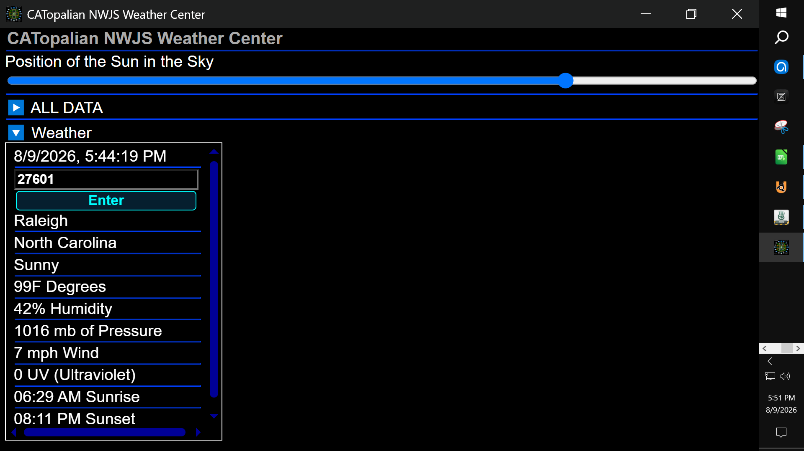
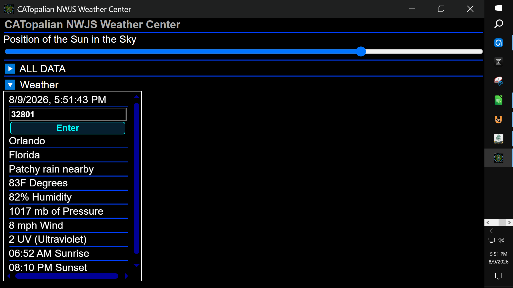
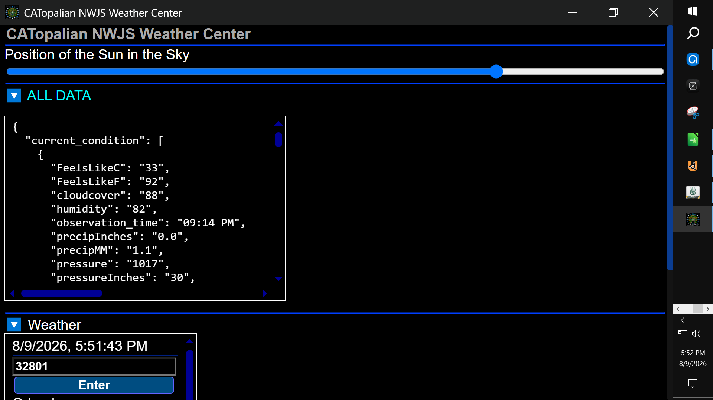

# CATopalian NWJS Science
A JavaScript NW.js Node.js HTML, CSS, application where we fetch  and show real time weather and environmental data from the internet!

> Note: We will be updating the date and time setting soon to match the zipcode entered.

---

REQUIREMENTS:
* Node.js https://nodejs.org/en

* NW.js https://nwjs.io/  

---

Video: https://www.youtube.com/watch?v=Sl2rF3Jqf5c

---

To run this application we:
* Download NW.js
* Extract All
* Find the nw.exe icon
* Drag the folder named CATopalian_NWJS_Science onto the nw.exe icon  

Full Instructions on Running our app here: https://github.com/ChristopherAndrewTopalian/CATopalian_JavaScript_NW.js

---

### How to Download this App
1. Click the green Code Button on this github page
2. Choose Download ZIP
3. Save the Zip File
4. Extract All
5. Drag the folder named CATopalian_NWJS_Science onto the nw.exe icon 

---

Happy Scripting :-)

---

// Dedicated to God the Father  
// All Rights Reserved Christopher Andrew Topalian Copyright 2000-2026  
// https://github.com/ChristopherAndrewTopalian  
// https://github.com/ChristopherTopalian  
// https://sites.google.com/view/CollegeOfScripting

